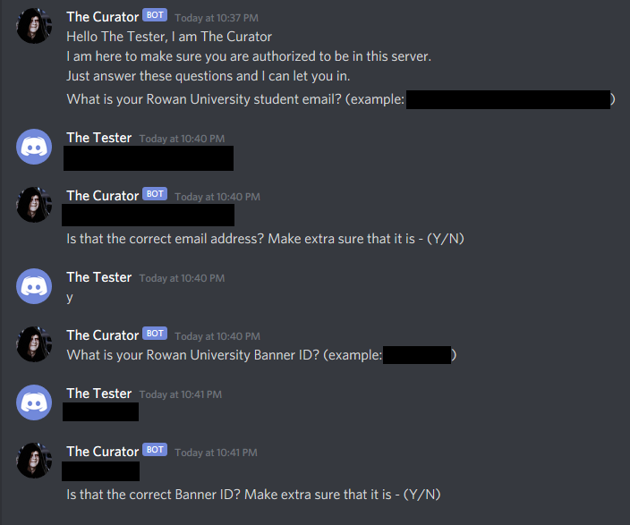
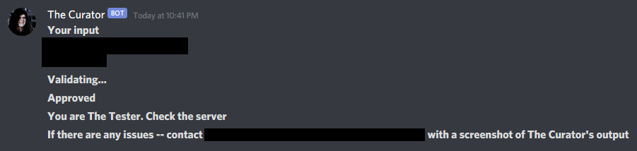
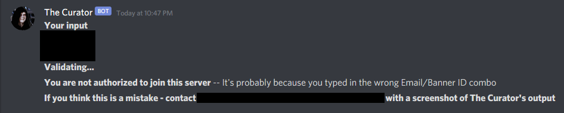
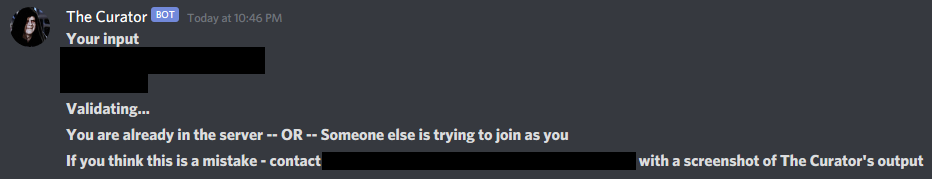

# The Curator
A very custom user authentication bot for Discord.

Probably too custom for wide use but you can use it as a template for something else if you like.

### Features
The Curator is a custom bot designed to authenticate users into a Discord server.

The Curator authenticates users using their Rowan University student emails and their Rowan University student IDs. Both must match  in combination (email && ID) and to what is stored in the student csv file to authenticate the user.

Once the user has been authenticated, they are automatically assigned a role based on their class. This role permits the user
to post and read messages in a specific channel and to access the rules of the server.

Additionally, after the authentication process, the user is assigned a unchangeable nicnkame - their first name and last name - to ensure appropriate naming. It's mainly for me to know who I'm talking to.

Finally, The Curator also makes sure that the user is unique to the server. It makes sure that only one discord account is associated to each student based on their student email and student ID. If a student tries to authenticate with another student's information, they are denied.

### Student CSV File
The Curator uses a master student list which is a csv file that looks like this:

```
Legal Name,Rowan ID Number,Email Address,Role
"<LAST NAME>, <FIRST NAME>",<STUDENT ID>,<STUDENT EMAIL>,<ROLE>
"<LAST NAME>, <FIRST NAME>",<STUDENT ID>,<STUDENT EMAIL>,<ROLE>
...
```

### .env File
This bot uses a environment variable called ```DISCORD_TOKEN``` to connect and communicate with the Discord server. It should be in the same directory as the ```curator.py``` file. The ```.env``` file looks like this:

```
# .env
DISCORD_TOKEN = <INSERT BOT DISCORD TOKEN HERE>
```

### Sample Usage

#### Initial invite

*The server administrator will have to send out an initial invite to users. After using the invite link, users can begin communicating with The Curator.*

##### Providing student email and student ID 

*Certain information is redacted to protect Rowan University*



##### User is approved

*Certain information is redacted to protect Rowan University*




##### User is denied

*Certain information is redacted to protect Rowan University*



##### User is marked as a duplicate

*Certain information is redacted to protect Rowan University*



### Contributing
Pull requests are wellcome but I don't plan on augmenting the capabilities of this bot in the near future. If you would still like to submit a pull request, please do so. For major changes, please open an issue first to further discuss what you would like to change.

### Disclaimer

This is a custom Discord bot. It was designed and developed by Tapan Soni for a very specific task. It accomplishes that task in a very specific way. If you decided to use this piece of software, remember that is is provided as is. Neither the author nor Rowan University take any responsibility whatsoever for any action performed by a user of this software, or any actions performed by this software outside of the user's control, intentionally or unintentionally.
